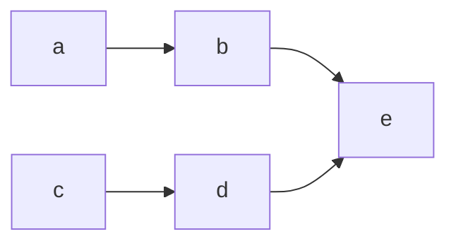

# Ampersand-nodes

When two nodes share a relationship with a third node, mermaid gives you a special `&` notation to capture that relationship, which shortens your code by one line. For example, you can turn the following:

into 

This may not seem like a large gain, but consider if you had a lot of relationships that are shared between nodes in your graph.