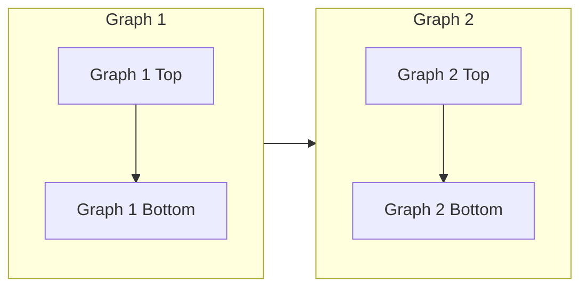
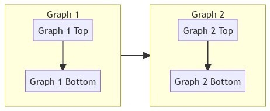

# Subgraphs

Subgraphs are a very handy tool in mermaid flowcharts diagram. They give you some control over how parts of the graph appear and the order in which things are connected. The implementation is for subgraphs is rather simple as you can see below:

The above code produces the following flowchart diagram.

Note the `LR` next to flowchart represents the left-to-right flow of the chart. Similarly, you can set the flow of the subgraph using the `direction` command, which we set to `TB`, or top-to-bottom, here.